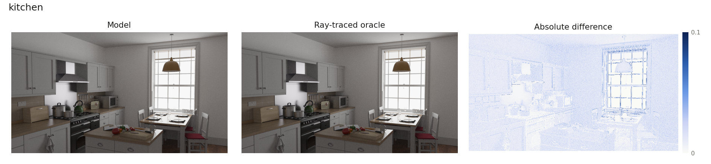
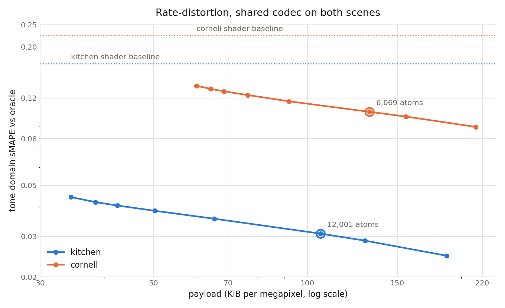

# affine-transport

This project applies instance-adaptive learned compression to ray tracing, fitting a compact per-frame model to a ray-traced reference for roughly 10⁴× less compute. A rasterised base shading pass is turned into a path-traced frame by transmitting that payload. Wherever the shader wrote nothing, such as glass or unlit surfaces, the hole is inpainted from its boundary and each 4×4 tile over it gets one affine transport layer, `B ↦ emit + transmittance · (B ∘ warp)`, fitted against the oracle and stored as an fp16 scalar plus an fp16 RGB triple. Everywhere else the residual is projected onto one shared colour axis, quantised to sixteen signed 5-bit amplitudes per tile, and tiles are spent in order of their measured sMAPE gain until the atom budget runs out. Since every atom costs the same 12 bytes, the per-tile decision is independent of the rest of the frame. `spec/AffineTransport.lean` states the whole thing as runnable code. The same encoder runs unchanged on both scenes below.

## Benchmark

Error is channelwise sMAPE against the oracle in tone space, `τ(x) = (x/(1+x))^(1/2.2)`. The operating point is 9.26% of tiles carrying an atom.

| scene | resolution | holes | shader sMAPE | model sMAPE | model PSNR | payload |
|---|---|---|---|---|---|---|
| kitchen | 1920×1080 | 6.3% | 0.1695 | 0.0309 | 35.50 dB | 220 KiB |
| cornell | 1024×1024 | 11.1% | 0.2250 | 0.1045 | 28.82 dB | 139 KiB |

Split by region, at the same operating point:

| scene | hole region, shader → model | shaded region, shader → model | layers | atoms |
|---|---|---|---|---|
| kitchen | 2.0000 → 0.0049 | 0.0462 → 0.0326 | 9,153 | 12,001 |
| cornell | 0.8286 → 0.0277 | 0.1492 → 0.1142 | 8,143 | 6,069 |

The transparent-layer stage does the heavy lifting and it does it cheaply: 73 KB of layer records take the kitchen glassware from no data at all to 0.019, and the same stage reconstructs the Cornell sphere and its caustic. Atoms take the glassware the rest of the way to 0.005. On log-log the rate curve is a straight line for both scenes, so each doubling of payload removes about a fifth of the remaining error.

Cornell is the harder scene and stalls higher. Its residual is chromatic. The fitted colour axis is (0.85, 0.45, 0.27), compared with the kitchen's near-grey (0.56, 0.58, 0.59), so a single shared axis cannot carry red and green wall bleed at once, and the shaded region only moves from 0.149 to 0.114. Per-tile colour, or two axes, is where the next byte should go.

For reference, the kitchen dump's own hybrid encoder reached 0.0321 using 1.20 MB; this pipeline reaches 0.0309 at 220 KB.

## Charts





Per-scene versions are `figures/compare_kitchen.png` and `figures/compare_cornell.png`. Difference maps are scaled 0 → 0.1 in tone units.

## Spec

`spec/AffineTransport.lean` is the encoder written out as an executable specification: every constant, every rounding rule, the tile addressing, and the byte accounting, in the order the encoder applies them. It exists so the pipeline can be rebuilt in another language without reading NumPy, so it is deliberately literal: `toFp16` is bit-exact against `numpy.float16`, `roundHalfEven` is `numpy.rint` rather than Lean's `Float.round`, and the hole fill is written as Jacobi iteration on the same linear system SciPy solves directly.

```
lean --run spec/AffineTransport.lean   # no dependencies, prints the worked example
python3 tools/check_spec.py            # same nine numbers out of src/codec.py
```

The worked example is an 8×8 frame with a hole in it. Both sides currently agree on all nine values, which is what keeps the spec honest as the encoder changes.

`spec/Invariants.lean` is separate and optional. It states over `ℝ` the two things the encoder relies on: layers compose as a monoid under front-to-back stacking, and equal-cost atoms make the frame's Lagrangian separable, so sorting by gain once and cutting at any budget is optimal. It is the only file that needs Mathlib.

## File map

```
src/codec.py             hole fill, layer fit, atom build and selection, byte accounting
src/scenes.py            renders the Cornell oracle and shader, unpacks the kitchen dump
src/bench.py             runs both scenes, writes results/ and the individual PNGs
src/figures.py           comparison panels and the rate-distortion chart
src/raster.py            tone PNG and difference PNG writers
spec/AffineTransport.lean  executable encoder spec, plain Lean 4
spec/Invariants.lean      
data/                    <scene>_shader_rgb_f32.npy, <scene>_oracle_rgb_f32.npy (not tracked)
results/                 benchmark.json, rate_curve.csv
figures/                 per-scene PNGs, comparison panels, rate-distortion chart
```
`make spec` runs the specification and the cross-check. `spec/Invariants.lean` checks under Lean 4.30 with Mathlib and has no `sorry`.
